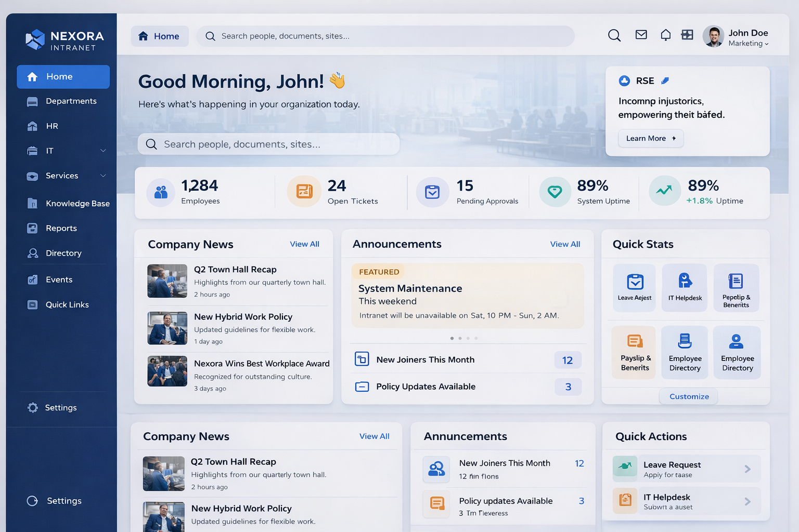

# 🏢 Enterprise Intranet Portal with Dashboard & Analytics
 
> A modern SharePoint Online intranet serving **500+ employees daily**, built with SPFx (React + TypeScript) and embedded Power BI dashboards for real-time KPI visibility.
 
---
# 🏢 Enterprise Intranet Portal (SharePoint + SPFx + Power BI)

> A modern, high-performance SharePoint Online intranet serving **500+ daily users**, featuring real-time analytics dashboards, personalized experiences, and enterprise-grade architecture.

---

## ⚡ TL;DR

* 🚀 Supports **500+ daily active employees**
* ⚡ Improved performance by **~40% (8s → 4.8s)**
* 📈 Increased employee engagement by **65% in 60 days**
* 📊 Integrated **5 Power BI dashboards** for real-time insights
* 🧩 Built **8 custom SPFx web parts**
* 🔗 Connected with **Microsoft Graph API + Azure Functions**

 ---
 
## 📌 Project Overview
 
| Detail | Info |
|---|---|
| **Type** | Intranet Modernization / BI & Analytics |
| **Platform** | SharePoint Online |
| **Users** | 500+ daily active employees |
| **Duration** | Enterprise-scale full lifecycle delivery |
| **Role** | SharePoint Developer (Freelance Consultant) |
 
---
 
## 🎯 Business Problem

The organization relied on a legacy SharePoint 2013 intranet that suffered from:

* 🐢 Slow load times (~8 seconds)
* ❌ No real-time business data visibility
* 📉 Low employee engagement
* 📧 Heavy dependency on manual processes (emails, Excel reports)

👉 Result: Poor productivity and lack of data-driven decision-making
---
 
## ✅ Solution
 
Designed and developed a modern SharePoint Online intranet platform with:

* ⚛️ Dynamic UI using SPFx (React + TypeScript)
* 📊 Embedded Power BI dashboards for live analytics
* 🔗 Microsoft Graph API integration for real-time employee data
* ☁️ Azure Functions for scalable backend processing

👉 Delivered a self-service digital workplace replacing manual workflows
---
 
## 🖼️ Screenshots

### 🏢 Home Dashboard

### 📊 Analytics Dashboard

### 👥 Employee Directory

### 📅 Events & Quick Links

---

## 🛠️ Tech Stack
 
| Layer | Technologies |
|---|---|
| **Frontend** | SPFx, React, TypeScript, Fluent UI, CSS3 |
| **Backend / API** | Microsoft Graph API, Azure Functions, PnP JS |
| **Analytics** | Power BI (embedded dashboards) |
| **Platform** | SharePoint Online, Microsoft 365 |
| **Dev Tools** | VS Code, Azure DevOps, PnP PowerShell |
 
---
 
## 🧩 Custom SPFx Web Parts Built
 
| # | Web Part | Description |
|---|---|---|
| 1 | **News Feed** | Dynamic company news with filtering by department |
| 2 | **Department Hub** | Per-department landing with links, contacts & docs |
| 3 | **Quick Links** | Personalized shortcut tiles with icon support |
| 4 | **Event Calendar** | Live SharePoint calendar with month/week view |
| 5 | **KPI Tracker** | Live metric cards pulling from Power BI datasets |
| 6 | **Org Directory** | Graph API-powered searchable employee directory |
| 7 | **Weather Widget** | Location-aware weather using external API |
| 8 | **Announcements** | Priority-based alert banner with dismissal |
 
---
 
## 📊 Power BI Dashboards Embedded
 
* 💰 Finance → Budget vs Actuals
* 👨‍💼 HR → Headcount, Attrition
* 🛠️ IT → Ticket SLA, Asset Status
* 📦 Operations → Delivery KPIs
* 📈 Sales → Pipeline & Revenue

👉 Enabled real-time decision-making across departments
 
---
 
## 📈 Results & Impact
 
| Metric | Before | After |
|---|---|---|
| Page load time | ~8 seconds (SP 2013) | ~4.8 seconds (~40% faster) |
| Employee engagement | Baseline | **+65% within 60 days** |
| Self-service adoption | Manual email requests | Full self-service portal |
| BI reporting | Manual Excel reports | Live embedded dashboards |
 
---
 
## 🏗️ Architecture Overview
 
```
SharePoint Online
│
├── SPFx Web Parts (React + TypeScript + Fluent UI)
│   ├── News Feed
│   ├── KPI Tracker ──────────── Power BI Embedded
│   ├── Org Directory ─────────── Microsoft Graph API
│   └── Event Calendar ────────── SharePoint List
│
├── Azure Functions (serverless backend)
│   └── External API calls (Weather, 3rd-party KPIs)
│
└── PnP JS / REST API
    └── SharePoint List & Library operations
```
 
---
 
## 🔐 Governance & Security
 
- RBAC enforced across all site collections
- Audience targeting on web parts per department
- Content approval workflows for news publishing
- Compliance-aligned retention policies on libraries
 
---
 
## 📁 Project Structure
 
```
📦 sharepoint-intranet-portal
 ┣ 📂 src
 ┃ ┣ 📂 webparts
 ┃ ┃ ┣ 📂 newsFeed
 ┃ ┃ ┣ 📂 departmentHub
 ┃ ┃ ┣ 📂 quickLinks
 ┃ ┃ ┣ 📂 eventCalendar
 ┃ ┃ ┣ 📂 kpiTracker
 ┃ ┃ ┣ 📂 orgDirectory
 ┃ ┃ ┣ 📂 weatherWidget
 ┃ ┃ └ 📂 announcements
 ┃ ┣ 📂 extensions
 ┃ └ 📂 shared
 ┃   ┣ 📂 components
 ┃   ┣ 📂 services
 ┃   └ 📂 utils
 ┣ 📂 config
 ┣ 📂 docs
 ┃ ┣ 📄 architecture.md
 ┃ ┣ 📄 deployment-guide.md
 ┃ └ 📄 web-part-catalog.md
 ┣ 📄 package.json
 ┣ 📄 tsconfig.json
 └ 📄 README.md
```
 
---
 
## 🚀 Deployment
 
1. Clone the repo
2. Run `npm install`
3. Update `config/serve.json` with your SharePoint site URL
4. Run `gulp serve` for local development
5. Run `gulp bundle --ship && gulp package-solution --ship` for production
6. Upload `.sppkg` to SharePoint App Catalog
7. Deploy to site collection
 
---
 
## 📬 Contact
 
<div align="center">

<table width="100%">
<tr>
<td align="center" style="padding:12px; background:#f3f2f1;">

**Bobba S Jaswanth Chowdary** · SharePoint Developer · India

[](https://www.linkedin.com/in/jaswanthchowdarybobba/)
[](mailto:bobbajasswanthchowdary@gmail.com)
[](https://github.com/jaswanthchowdarybobba)

</td>
</tr>
</table>

</div>
